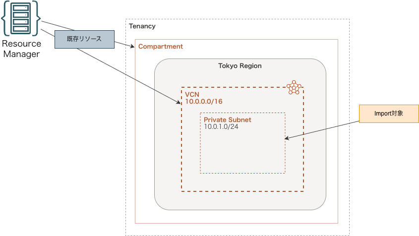

# OCI Resource Managerで既存リソースをimportしたい 〜terraform importとの違いと実践手順〜

- [詳細]()

## 構成図



## デプロイ - Terraform -

### 作業環境 - ローカル -

- macOS Tahoe ( v26.6.2 )
- Visual Studio Code 1.137.0
- oci cli 3.71.0
- Python 3.14.2
- Terraform v1.15.7 on darwin_arm64

### フォルダ構成

- [こちら](./folder.md) を参照

### 前提条件

- `manage all-resources IN TENANCY` を付与した IAM グループに所属する IAM ユーザーが作成されていること
- 以下コマンドを実行し、_ADMIN_ プロファイルを作成していること (デフォルトリージョンは _ap-tokyo-1_ )

```bash
oci session authenticate
```

### 事前作業(1)

#### 1. 各種モジュールインストール

- [GitHub](https://github.com/tyskJ/common-environment-setup) を参照

### 事前作業 - ローカル -

#### 1. 定義ファイルの圧縮

```bash
ZIP_FILE="stack.zip"
```

```bash
zip -r "${ZIP_FILE}" envs
```

#### 2. 関数定義

```bash
wait_job() {
  local JOB_ID=$1

  while true; do
    STATE=$(oci resource-manager job get \
      --job-id "${JOB_ID}" \
      --profile ADMIN \
      --auth security_token \
      --query 'data."lifecycle-state"' \
      --raw-output)

    echo "Job=${JOB_ID} State=${STATE}"

    case "${STATE}" in
      SUCCEEDED)
        echo "Job succeeded."
        return 0
        ;;
      FAILED|CANCELED)
        echo "ERROR: Job failed."
        oci resource-manager job get \
          --job-id "${JOB_ID}" \
          --profile ADMIN \
          --auth security_token
        return 1
        ;;
      *)
        sleep 30
        ;;
    esac
  done
}
```

### 実作業 - OCI Resource Manager -

#### 1. スタック作成

```bash
TENANCY_ID=$(oci iam compartment list \
  --lifecycle-state ACTIVE \
  --include-root \
  --profile ADMIN \
  --auth security_token \
  --query "data[?\"compartment-id\"==null].id | [0]" \
  --raw-output)
```

```bash
REGION=$(awk -F= '/\[ADMIN\]/{f=1} f && /^region=/{print $2; exit}' ~/.oci/config)
SYSTEM_NAME="oci-resource-manager-import"
TF_VER="1.5.x"
STACK_NAME="${SYSTEM_NAME}-stack"
```

```bash
cat <<EOF > terraform.tfvars.json
{
  "tenancy_ocid": "${TENANCY_ID}",
  "region": "${REGION}",
  "system_name": "${SYSTEM_NAME}",
}
EOF
```

```bash
oci resource-manager stack create \
--compartment-id "${TENANCY_ID}" \
--display-name "${STACK_NAME}" \
--description "Dev Stack" \
--config-source "${ZIP_FILE}" \
--working-directory "envs" \
--terraform-version "${TF_VER}" \
--variables file://terraform.tfvars.json \
--wait-for-state "ACTIVE" \
--profile ADMIN --auth security_token
```

#### 2. Plan Job 作成

```bash
STACK_ID=$(oci resource-manager stack list \
  --all \
  --compartment-id "${DIP_COMPARTMENT_OCID}" \
  --display-name "${STACK_NAME}" \
  --profile ADMIN --auth security_token \
  --query 'data[0].id' \
  --raw-output)
```

```bash
# ① Job作成（ここでIDは必ず取得）
PLAN_JOB_ID=$(oci resource-manager job create-plan-job \
  --stack-id "${STACK_ID}" \
  --display-name "${STACK_NAME}-plan" \
  --profile ADMIN --auth security_token \
  --query 'data.id' \
  --raw-output)

echo "PLAN_JOB_ID=$PLAN_JOB_ID"

wait_job "${PLAN_JOB_ID}"
```

```bash
oci resource-manager job get-job-tf-plan \
  --job-id "${PLAN_JOB_ID}" \
  --tf-plan-format JSON \
  --file tfplan.json \
  --profile ADMIN \
  --auth security_token >/dev/null

jq -r '
.resource_changes[]?
' tfplan.json
```

#### 3. Deploy

```bash
APPLY_JOB_ID=$(
  oci resource-manager job create-apply-job \
    --stack-id "${STACK_ID}" \
    --execution-plan-strategy FROM_PLAN_JOB_ID \
    --execution-plan-job-id "${PLAN_JOB_ID}" \
    --display-name "${STACK_NAME}-apply" \
    --profile ADMIN \
    --auth security_token \
    --query 'data.id' \
    --raw-output
)

echo "APPLY_JOB_ID=${APPLY_JOB_ID}"

wait_job "${APPLY_JOB_ID}"
```

### Resource Discovery 設定

```bash
OCI_PROVIDER_VERSION="9.3.0"
OCI_PROVIDER_ARCH="arm64"
```

```bash
OCI_PROVIDER_TMP_DIR="/tmp/oci-provider"
mkdir -p "${OCI_PROVIDER_TMP_DIR}"
```

```bash
curl -L \
  -o "${OCI_PROVIDER_TMP_DIR}/terraform-provider-oci_${OCI_PROVIDER_VERSION}_darwin_${OCI_PROVIDER_ARCH}.zip" \
  "https://releases.hashicorp.com/terraform-provider-oci/${OCI_PROVIDER_VERSION}/terraform-provider-oci_${OCI_PROVIDER_VERSION}_darwin_${OCI_PROVIDER_ARCH}.zip"
```

```bash
unzip \
  "${OCI_PROVIDER_TMP_DIR}/terraform-provider-oci_${OCI_PROVIDER_VERSION}_darwin_${OCI_PROVIDER_ARCH}.zip" \
  -d "${OCI_PROVIDER_TMP_DIR}" \
  && rm -f "${OCI_PROVIDER_ZIP}"

ls -l "${OCI_PROVIDER_TMP_DIR}"
```

```bash
sudo mv \
  "${OCI_PROVIDER_TMP_DIR}"/terraform-provider-oci_* \
  /usr/local/bin/
```

```bash
OCI_PROVIDER_BIN=$(ls /usr/local/bin/terraform-provider-oci*)
echo "${OCI_PROVIDER_BIN}"
```

```bash
sudo ln -sfn \
  "${OCI_PROVIDER_BIN}" \
  /usr/local/bin/tf-oci

ls -l /usr/local/bin/tf-oci
```

```bash
tf-oci -command=list_export_services
tf-oci -command=list_export_resources
```

### Import リソース

### 後片付け - ローカル -

#### 1. 環境削除

```bash
DESTROY_JOB_ID=$(oci resource-manager job create-destroy-job \
  --stack-id "${STACK_ID}" \
  --execution-plan-strategy AUTO_APPROVED \
  --display-name "${STACK_NAME}-destroy" \
  --profile ADMIN \
  --auth security_token \
  --query 'data.id' \
  --raw-output)

echo "DESTROY_JOB_ID=${DESTROY_JOB_ID}"

wait_job "${DESTROY_JOB_ID}"
```

```bash
oci resource-manager stack delete \
  --stack-id "${STACK_ID}" \
  --force \
  --wait-for-state DELETED \
  --profile ADMIN \
  --auth security_token
```

### 番外編

#### スタック更新

```bash
zip -r "${ZIP_FILE}" envs
```

```bash
oci resource-manager stack update \
  --stack-id "${STACK_ID}" \
  --config-source ${ZIP_FILE} \
  --working-directory "envs" \
  --terraform-version "${TF_VER}" \
  --variables file://terraform.tfvars.json \
  --wait-for-state "ACTIVE" \
  --profile ADMIN \
  --auth security_token \
  --force
```

```bash
# ① Job作成（ここでIDは必ず取得）
PLAN_JOB_ID=$(oci resource-manager job create-plan-job \
  --stack-id "${STACK_ID}" \
  --display-name "${STACK_NAME}-plan" \
  --profile ADMIN --auth security_token \
  --query 'data.id' \
  --raw-output)

echo "PLAN_JOB_ID=$PLAN_JOB_ID"

wait_job "${PLAN_JOB_ID}"
```

```bash
oci resource-manager job get-job-tf-plan \
  --job-id "${PLAN_JOB_ID}" \
  --tf-plan-format JSON \
  --file tfplan.json \
  --profile ADMIN \
  --auth security_token >/dev/null

jq -r '
.resource_changes[]?
' tfplan.json
```

```bash
APPLY_JOB_ID=$(
  oci resource-manager job create-apply-job \
    --stack-id "${STACK_ID}" \
    --execution-plan-strategy FROM_PLAN_JOB_ID \
    --execution-plan-job-id "${PLAN_JOB_ID}" \
    --display-name "${STACK_NAME}-apply" \
    --profile ADMIN \
    --auth security_token \
    --query 'data.id' \
    --raw-output
)

echo "APPLY_JOB_ID=${APPLY_JOB_ID}"

wait_job "${APPLY_JOB_ID}"
```

#### オブジェクトバルクアップロード

```bash
oci os object bulk-upload \
  --bucket-name "${BUCKET_NAME}" \
  --src-dir . \
  --overwrite \
  --exclude ".gitconfig" \
  --exclude "*.zip" \
  --exclude "*.md" \
  --exclude "*.rst" \
  --exclude ".gitignore" \
  --exclude "doc/*" \
  --exclude ".git/*" \
  --exclude ".DS_Store" \
  --profile ADMIN --auth security_token
```

#### オブジェクトバルクデリート

```bash
oci os object bulk-delete \
  --bucket-name "${BUCKET_NAME}" \
  --force \
  --profile ADMIN --auth security_token
```

### 参考資料

#### リファレンス

- [リソース検出の設定 - Oracle Cloud Infrastructure ドキュメント](https://docs.oracle.com/ja-jp/iaas/Content/dev/terraform/tutorials/tf-resource-discovery-setup.htm)
